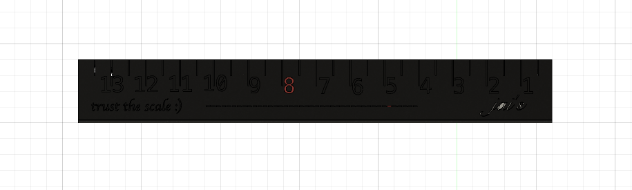
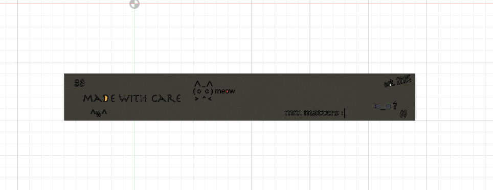

# Jai's Ruler

A custom 3D printed ruler model.

## Overview

This project contains the design files for a precision 3D printed ruler. The model is provided in multiple formats for compatibility with various CAD and 3D printing software.

## Author

**Jaimin Pansal**

## Files

- `jai'sruler.f3d` - Fusion 360 design file
- `jai'sruler.step` - STEP format for universal CAD compatibility

## Preview

### Front View

### Back View

## 3D Printing

This ruler model can be printed on most FDM or resin 3D printers. 

## Usage

1. Download the design file in your preferred format
2. Import into your 3D printing slicer software
3. Adjust settings as needed for your printer
4. Print and enjoy your custom ruler!

## License

Created by Jaimin Pansal. MIT License.

